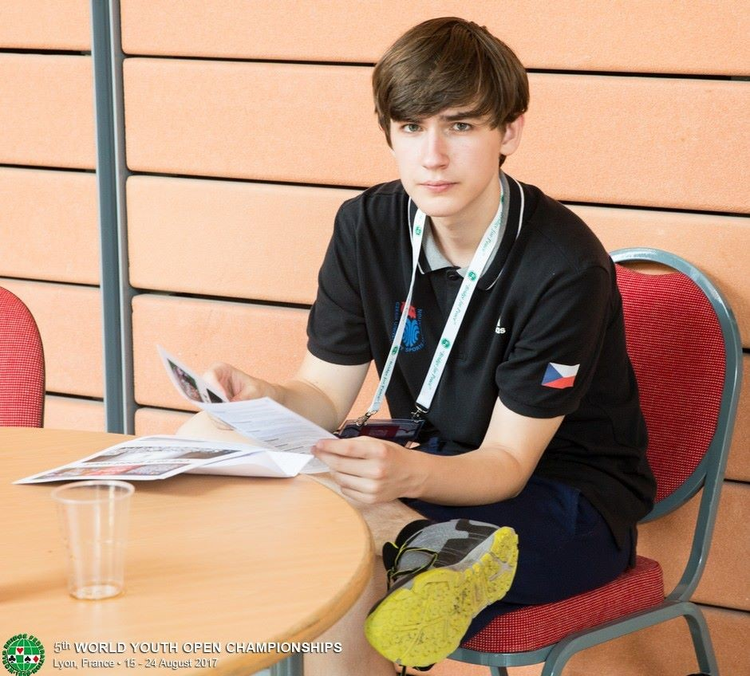
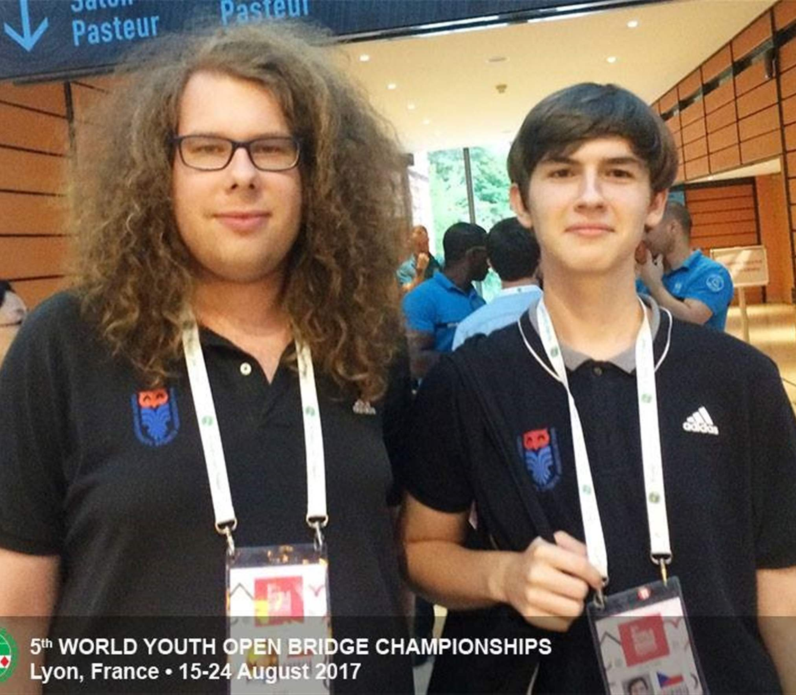
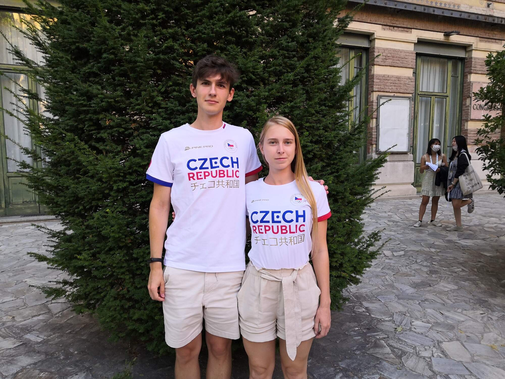
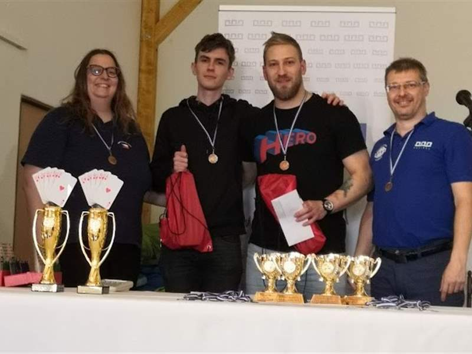
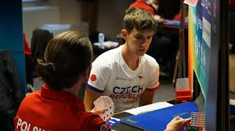
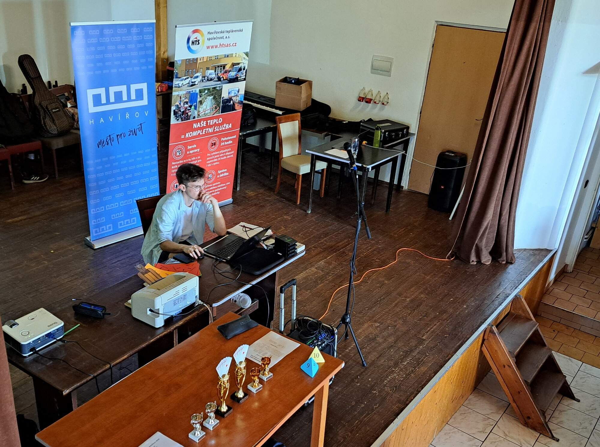

 

já v Lyonu

  

Jméno mé jest Zdeněk Tomis a jsem bridžový hráč, vedoucí turnajů a nadšenec.

Kromě toho jsem softwarový inženýr, zajímám se o literaturu, jazyky a sport.

Momentálně žiju v Praze, kde také studuji a pracuji.

## Kontakt

Můžete mě kontaktovat na mém emailu 
[zdnek.tomis@gmail.com](mailto:zdnek.tomis@gmail.com) nebo telefonicky na 
[732 767 888](tel:732767888).

Také můžete navštívit [můj LinkedIn profil](linkedin.com/in/zdenek-tomis) nebo 
osobní webovou stránku [zdenektomis.eu](https://zdenektomis.eu).

## Klub a svaz

Momentálně jsem členem [Pražského bridžového klubu](https://bkpraha.cz), kde 
řídím turnaje a působím jako člen 
[výboru klubu](https://bkpraha.cz/klub).

Jsem také členem 
[Českého bridžového svazu](https://www.czechbridge.cz/), kde působím jako 
člen [Výkonného výboru](https://www.czechbridge.cz/union).

**Budu rád za jakékoliv otázky, zpětnou vazbu, nápady nebo podněty.**

## Já, hráč

Bridž hraji od roku 2013. Účastnil jsem se mnoha turnajů, jak v Česku, tak i v zahraničí.

Já s Adamem Janasem v Lyonu, Francie

Já s Adamem Pyszkem v Českých Budějovicích, Česko

Já s Veronikou Dolanskou v Salsomaggiore Terme, Itálie

Já s Martinem Scháňkou, Danem Vachtarčíkem a Soňou Hájkovou, Havířov

Já v Antverpách

Na [Bridge Base Online](https://www.bridgebase.com) mě najdete pod jménem `zdenecek`, kde většinou odpočívám hraním s roboty.

Na některé moje výsledky se můžete podívat do databáze WBF [zde](http://db.worldbridge.org/Repository/peopleforscrappcm/person.asp).

Pro výsledky v Česku se podívejte na [Matriku Českého bridžového svazu](https://matrikacbs.cz/Detail-hrace.aspx?id=2876).

## Já, vedoucí turnajů

 

já, řídím Velkou cenu Havířova

  

Bridžové turnaje řídím od roku 2021.

V sekci [turnaje](/tournaments) naleznete seznam národních turnajů, kterých jsem se zúčastnil jako rozhodčí, a sekci [turnaje v Pražském bridžovém klubu](/bkp-tournaments) pro seznam turnajů v Pražském bridžovém klubu, které jsem řídil.

## HABRA - kde jsem se naučil bridž

[HABRA - HAvířovská BRidžová Akademie](https://bridzhavirov.cz) - je bridžová škola a klub v Havířově,kde jsem vyrůstal a naučil se hrát bridge.

Rád bych vyjádřil svůj velký vdě a obdiv, kteří tuto školu založili a tak dobře se o ni starají, zejména mému prvnímu učiteli bridge, Jardovi Hájkovi, a mým dalším učitelům, kolegům a partnerům, Danielu Vachtarčíkovi, Soně Hájkové a Petru Pszczolkovi.
