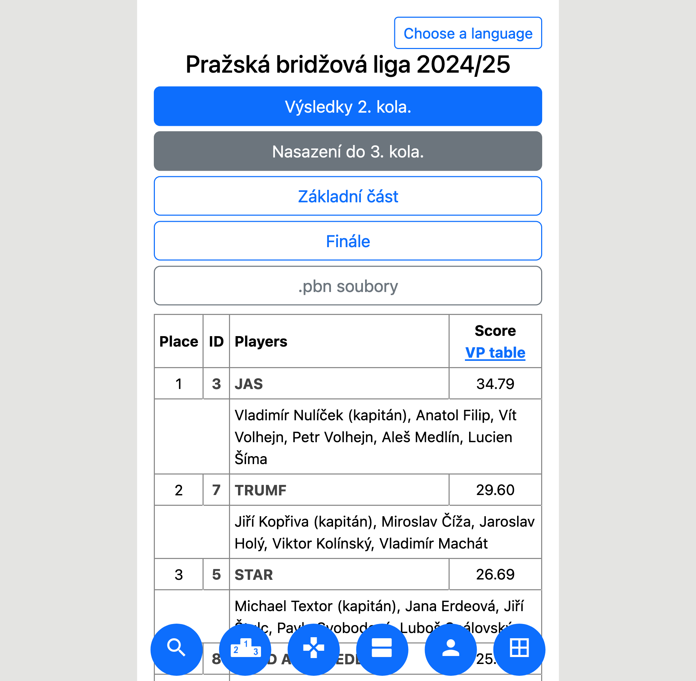

Tato stránka obsahuje uživatelský, hráčský návod na prezentace turnajů
generované programem Tournament Calculator, který používám na výpočet výsledků turnajů.

[Tournament Calculator](tournamentcalculator.com) je polský program Stanislawa
Mączky, který jsem začal používat na turnajích v roce 2022.

Program generuje webové stránky, které slouží jako prezentace s výsledky.
Zároveň se na těchto stránkách zobrazují i průběžné výsledky, pokud to vedoucí
povolí.

Prezentace vypadá například takto:

## Základní prvky

V pravém horním rohu je možné změnit jazyk prezentace.

Pod názvem turnaje je lišta s tlačítky, která se pro každý turnaj může lišit.
Formát nastavuje vedoucí pro každou prezentaci zvlášť, můžou tam být například
odkazy na stránky, zkratky v rámci prezentace, tlačítka pro zobrazení různých
výsledků, atd.

Příklad: prezentace ze Slavonic 2024:

Vidíme, že horní lišta je zcela odlišná od předchozího obrázku.

Na druhou stranu, níže položená navigační lišta, vedle nápisu TC, je stejná.
Toto platí pro všechny prezentace, může se lišit pouze částečně, a to podle typu
turnaje - párového a týmového- a podle nastavení vedoucího. Většinou je rozdíl v
tom, jestli se zobrazuje Butler a Křížová tabulka, podle toho, jestli se jedná o
týmový turnaj a co vedoucí povolí.

### Prvky navigace

- Results - celkové výsledky
- Private scores - soukromé zápisáky

  Pro zobrazení je nutné zadat číslo. Toto číslo může být buď číslo páru, resp.
  týmu, **nebo legitimace hráče podle Matriky ČBS**.

  Na soukromé výsledky se dá přejít kliknutím na číslo týmu v záložce Results.

  V týmových turnajích se zde vyskutuje tlačítko Roster, které zobrazí soupisku
  týmu.

- Round results - výsledky jednotlivých kol
- Butler
- Cross table - Křížová tabulka

#### Funkce Follow (Sledovat)

Dále v navigaci je pole pro zadání čísla a tlačítko Follow. Po zadání čísla
týmu, páru, nebo legitimace hráče a kliknutí na tlačítko Follow budou ve všech
tabulkách zvýrazněny výsledky tohoto hráče, resp. týmu.

Tlačítko Reset zruší sledování.

## Číslování rozdání

Pokud turnaj není rozdělený na více fází (např. kvalifikace a finále), je v
rámci prezentace jediná číselná řada pro všechna rozdání.

Pokud se například hrají dvě kola a rozdání jsou číslována od 1 do 26 v obou
kolech, bude v prezentaci číslování od 1 do 52.

V závorce je vždy uvedeno číslo rozdání jak bylo hráno, zároveň je mu ale
přiřazeno nové číslo pro potřeby prezentace. Na obrázku níže je toto zvýrazněno
fialovým rámečkem.

Dále je možné přejít přímo na rozdání zadáním čísla rozdání (zvýrazněno zeleně),
toto ale musí být číslo dle číslování v prezentaci. Pokud bychom chtěli přejít
na rozdání 23 z druhého kola příkladu výše, musíme zadat 49 (26 + 23).

## Ovládání v mobilním zařízení

Na mobilních zařízeních se ovládací prvky zobrazují jinak. Rozdílemu zobrazení
na telefonu a počítači se říká responzivní design a je dáno tím, že prst na
dotykovém displeji má jiné možnosti než myš na počítači.

Bohužel ale prezentace na mobilních zařízeních poskytuje tlačítka popsaná
obrázky a ne textem. Proto je nutné si zapamatovat, co které tlačítko dělá.

Tlačítka jsou zobrazena dole a mají následující význam:

| tlačítko                           | význam                 |
| ---------------------------------- | ---------------------- |
|      | funkce follow (sleduj) |
|     | celkové výsledky       |
|       | rozdání                |
|      | výsledky kol           |
|      | butler                 |
|  | křížová tabulka        |

## Odkazy

Níže naleznete odkazy na prezentace, které byly uvedeny jako příklad:

- [Slavonice 2024](https://bridge.zdenektomis.eu/vysledky/2024/slavonice/tymy/1/)
- [Pražská bridžová liga 2024/25](https://vysledky.bkpraha.cz/prezentace/2024/prazska-bridzova-liga/)
