- [Možnosti vytvoření turnaje](#možnosti-vytvoření-turnaje)
- [Založení prázdného turnaje](#založení-prázdného-turnaje)
- [Navigace v programu](#navigace-v-programu)
- [Navedení hráčů](#navedení-hráčů)
  - [Pauza](#pauza)
- [Import střídání](#import-střídání)
- [Vytvoření BWS databáze a spuštění bridgematů](#vytvoření-bws-databáze-a-spuštění-bridgematů)
- [Nastavení prezentace](#nastavení-prezentace)
- [Konec turnaje](#konec-turnaje)
- [Odkazy](#odkazy)


Tento článek popisuje, jak využít Tournament Calculator pro pořádání klubových
turnajů. Tedy párových turnajů s jedním kolem.

## Možnosti vytvoření turnaje

Při vytváření turnaje máme v zásadě dvě možnosti:

1. Použijeme průvodce (wizard), který nám dá na výběr z předdefinovaných
   střídaní, podle toho, kolik máme stolů a kolik rozdání chceme hrát. TC umí
   mnoho různých střídání. Střídací lístky pak můžeme vytisknout, případně
   můžeme střídat podle BridgeMate (Zobrazit jména hráčů umí jen nové BridgeMaty - verze 2).

2. Vytvoříme prázdný turnaj a střídání importujeme. Tento přístup má tu výhodu,
   že můžeme využít předpřipravené střídací lístky.

Pro import střídání je potřeba mít střídání ve formátu, který TC umí načíst. TC
umí načíst střídání v `.csv` (formát hodnoty oddělené čárkou) a sice ve velmi
jednoduchém formátu, kde každý řádek představuje jednu sestavu a stůl a má tuto
podobu:

```text
stůl,sestava,ns,ew,rozdání nejnižší,rozdání nejvyšší
```

Kde `ns` a `ew` jsou čísla párů.

Tento formát má jednu implikaci, a sice že pro turnaje, kde se hrají v jednom
kole rozdání z nesouvislého intervalu (např. 1-3 a 7-9), je potřeba rozdělit
kola na půlkola. Nic jako půlkola ale v TC neexistuje, každé kolo se rozdělí na
dvě celá kola a celkový počet kol bude dvojnásobný.

Pro účely toho článku vytvořím turnaj prázdný a střídání importuji. Jako příklad
poslouží turnaj na čtyři stoly, použijeme předpřipravený soubor se střídáním.

## Založení prázdného turnaje

1. `File -> Empty -> Pairs`
2. Otevře se mi dialog pro uložení turnaje, vyberu název a umístění souboru.

   Soubory turnajů v TC mají příponu `.npc` a celý turnaj je obsažen v jediném
   souboru.

## Navigace v programu

Nyní máme otevřený prázdný turnaj. Záložky v horní části programu slouží k
navigaci. V programu jsou tyto záložky:

- **General** - obecné - zde nemusím nic měnit, obsahuje přehled o turnaji
- **Presentation** - nastavení prezentace, která je webová stránka, nahrávaná
  automaticky přes FTP. Také se zde nastavuje název turnaje.
- **Calculation** - výpočty - zde lze sledovat a upravovat výsledky a také
  nahrát rozdání ve formátu PBN, aby se poté zobrazily v prezentaci.
- **Participants** - účastníci
- **Movement** - střídací rozpisy
- Záložky Adj./pen., Rewards a Vugraph jsou pro nás nepodstatné.
- **BWS** - Správa bridgematů - zde se vytvoří soubor s databází pro bridgemate
  a lze odsud také rovnou spustit program pro obsluhu bridgematů.


V dalších krocích postupně provedeme postupně tyto úkony:

1. Navedení hráčů
2. Import střídání
3. Vytvoření BWS databáze a spuštění bridgematů
4. Nastavení prezentace

## Navedení hráčů

Pro tento účel navedeme do programu databázi českých hráčů z ČBS.

Databázi hráčů lze stáhnout z [Matriky ČBS](https://matrikacbs.cz/). Formát souboru ale není ve správném formátu. Upravený soubor lze stáhnout [zde]().

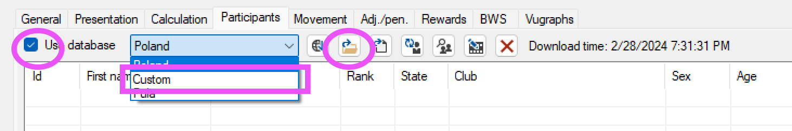

Nyní máme navedenou databázi a můžeme přidat hráče.

Přidám správný počet párů. V našem případě 8 párů. 


1. Kliknu na tlačítko `+`
2. Zadám 1-8 pro čísla párů od 1 do 8, potvrdím.

Nyní postupně zadáme všechny hráče, zadáním např. příjmení lze vyhledat hráče v databázi, dvojitým poklepáním na jméno hráče ho přidáme do turnaje, případně lze taky přeskakovat mezi panelem s databází a s hráči pomocí F1 a nalezeného hráče potvrdit pomocí Enter.

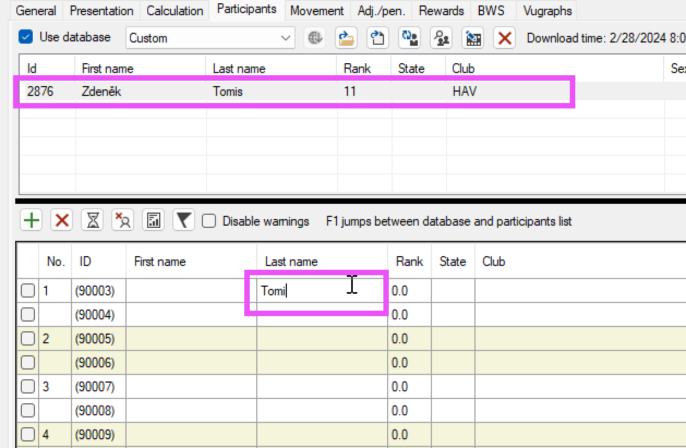

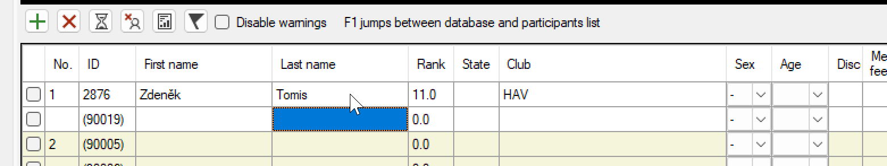

Alternativně lze do tabulky kopírovat více buněk najednou, poté lze využít možnosti vyplnit pouze jména a zbytek zkusit doplnit podle databáze, viz níže:

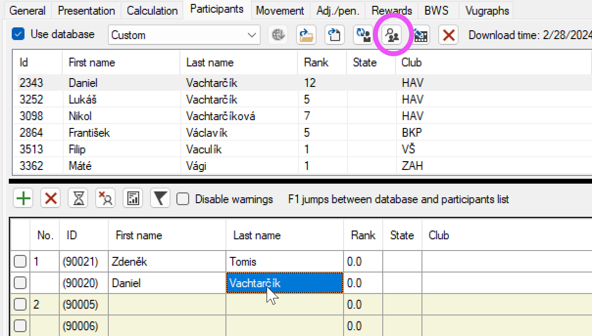

Vyplníme pouze jména, ta lze zkopírovat z přihlášek, a klikneme na tlačítko dohledat hráče.

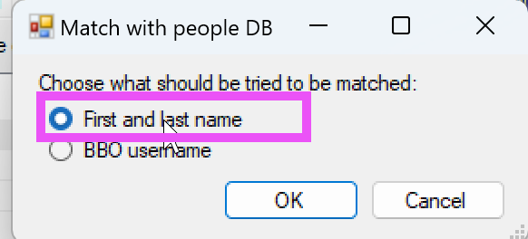

Vybereme vyhledávání podle jmen.

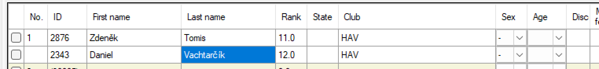

Hráčům byla doplněna čísla ČBS.

Ruční zadávání hráčů je možno zcela přeskočit, pokud necháme zadat hráče jejich čísla do bridgematů. Potom lze hráče přečíst a přiřadit podle databáze tlačítkem v záložce BWS.

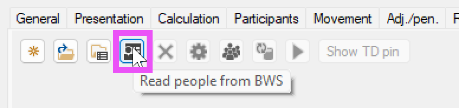

### Pauza

Pauzu můžeme zadat následujícím způsobem:

1. V záložce `Participants` klikneme na tlačítko `Manage sit-outs`
2. V dialogu zadáme číslo pauzujícího páru, případně více, oddělené čárkou.
3. Potvrdíme.

Tím, že pauzu zadáme před vytvořením BWS, docílíme toho, že Bridgematy budou správě přeskakovat zadání výsledků u pauzujících párů.

Dále je ale nutné zadat výsledky s pauzou v Tournament Calculator. Pokud máme zapnuto nastavení `Enter sit-out results automatically`, budou výsledky zadány automaticky. 

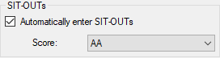

Z dokumentace:TC automaticky vyplní výsledky tam, kde hraje SIT-OUT. Výsledky pro jednotlivá kola budou vyplněny, jakmile bude zadáno 30 % všech výsledků daného kola.

V opačném případě je nutné zadat výsledky ručně v záložce `Calculation`.

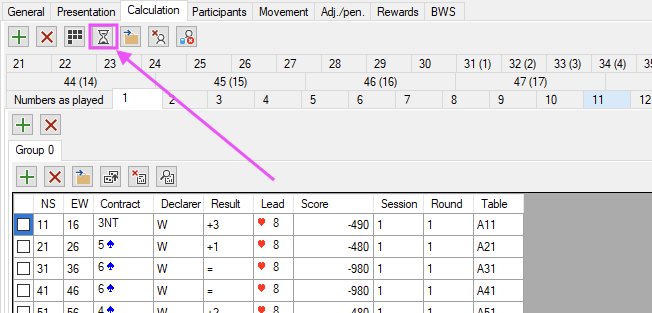

Tato akce umožnuje čtyři možnosti výsledků s pauzou:
- SIT-OUT - výsledek se nezapočte
- AA - průměr
- AM - "průměrné mínus" 
- AP - "průměrné plus"

Pro většinu případů je nejvhodnější možnost SIT-OUT.

## Import střídání

Nyní máme navedené hráče a můžeme importovat střídání.

1. V záložce `Movement` klikneme na horní tlačítko `load movement from NTPN/CSV/TXT` pro vytvoření nového kola s požadovaným střídáním.


2. Vybereme soubor, v našem případě `4zluta.csv` a potvrdíme.
3. Program zobrazí report s kvalitou střídání, potvrdíme.
4. Klikneme na tlačítko `Synchronize with scores` pro sjednocení rozpisu s výpočty.

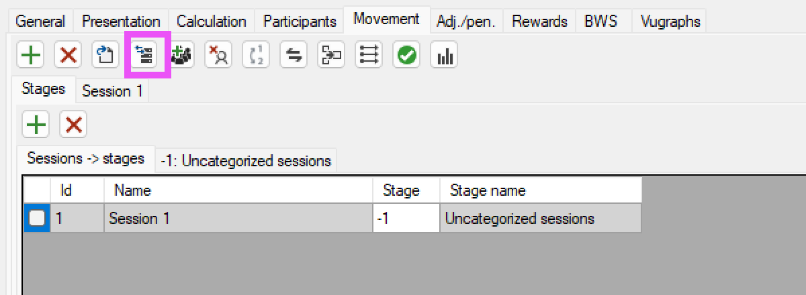

Vybereme všecha kol pomocí políčka All.

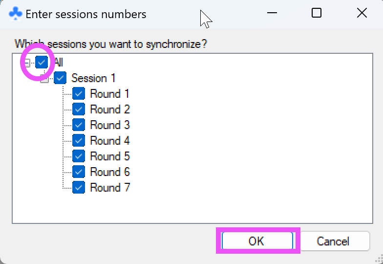

Odklikneme OK v potvrzovacím dialogu.

## Vytvoření BWS databáze a spuštění bridgematů

1. V záložce BWS klikneme na tlačítko `Create new BWS`  
   BWS je formát databáze výsledků pro bridgematy. Nikdy ho nebudeme přímo upravovat, ale pro zajímavost se jedná o databázi MS Access se změněnou příponou.

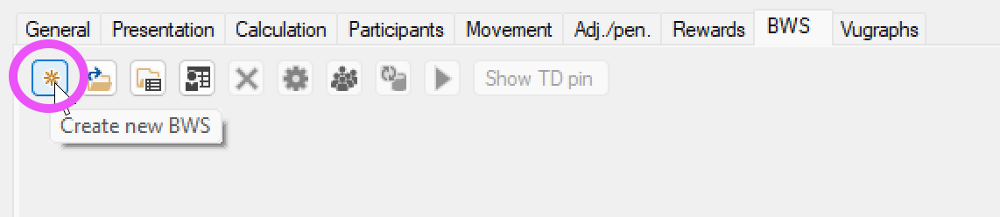

2. V dialogu vybereme soubor, kam se má BWS uložit a potvrdím.
3. Opět zvolím všechna kola kliknutím na políčko `All` a potvrdím.
4. Otevře se nastavení bridgematů, tato nastavení odpovídají nastavením, která se dají změnit v programu BCS pro obsluhu bridgematů.

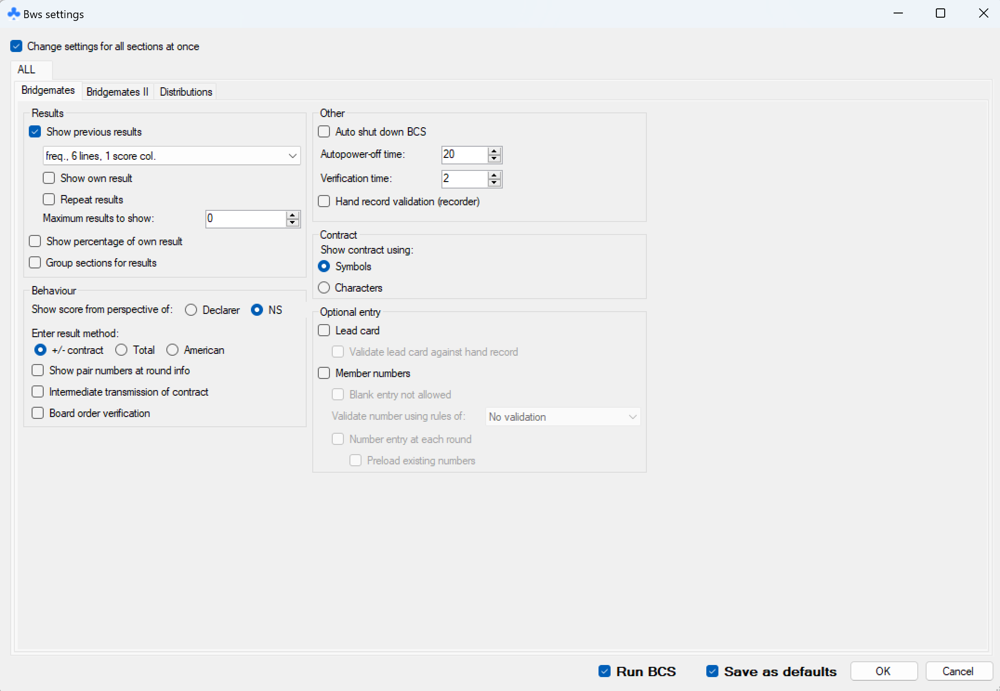

Z nastavení jsou tato nejdůležitější:

- Show previous results - ukazovat výsledky z ostatních stolů. Osobně to nemám rád, zdržuje to, na klubovém turnaji to může být příjemné pro hráče, většina to má ráda.
- Lead card - zadávání výnosů - na klubovém turnaji je to asi zbytečné.
- Member numbers - čísla hráčů - pokud jsou čísla hráčů vložena do bridgematů, lze je přečíst a přiřadit podle databáze tlačítkem v záložce BWS. 
  - Number entry at each round - zadávání čísel hráčů při každém kole - není potřeba.
- Run BCS (dole) - rovnou spustí program pro obsluhu bridgematů s vytvořenou databází.
- Save as defaults (dole) - uloží nastavení jako výchozí, při vytváření další BWS se tato nastavení přednačtou.

Doporučuji vše nastavit podle obrázku výše.

Poté stačí potvrdit OK a program vytvoří soubor s databází a spustí program pro obsluhu bridgematů (pokud jsme zvolili Run BCS).

Pokud se BCS nespustí, je možné, že není nastavena cesta k programu, TC ukáže chybovou hlášku. Tuto cestu lze nastavit v záložce `BWS` v sekci Nastavení, viz níže.

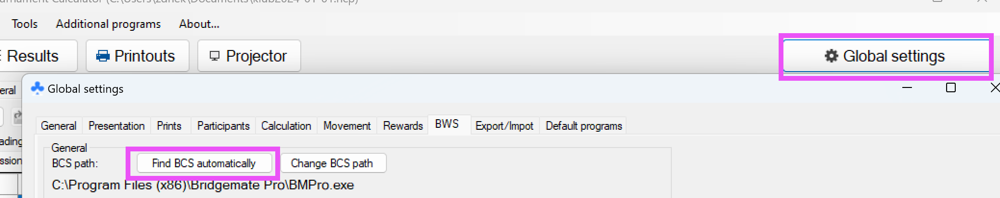

Poté je vždy možné spustit BCS z TC, a to pomocí zeleného tlačítka Run BCS.


## Nastavení prezentace

Pro prezentaci musím vyplnit správně

- FTP údaje
  - cestu ve formátu ftp://adresa-serveru/relativni/cesta/adresare/pro/prezentaci
  - uživatelské jméno/login
  - heslo
- Název turnaje

Cestu doporučuji volit systematicky, například pro každý rok jeden adresář, nebo adresář s názvem začínajícím datem, např. `2024-02-12-klubovy-turnaj`, nebo `2024/02-12-klubovy-turnaj`.

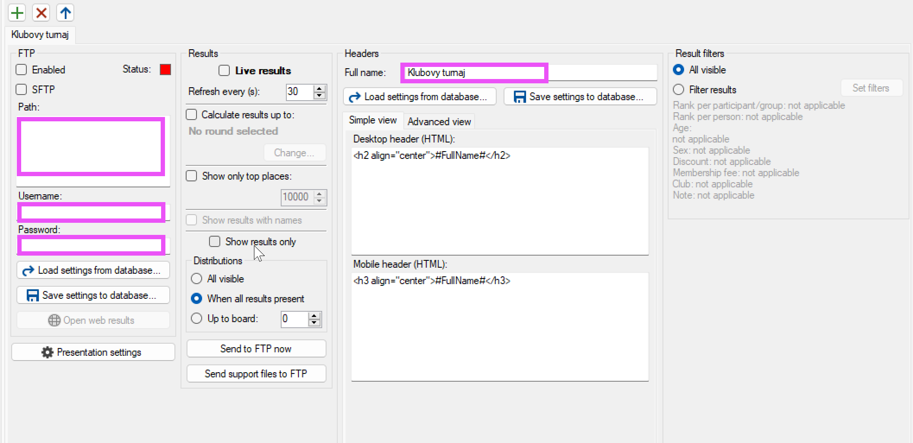

Další možnosti, které lze nastavit:

- `Live results` - zobrazovat výsledky živě
- `Show results only` - nezobrazovat rozdání
- Distributions - Možnost `When all results present` zobrazí v prezentaci rozdání, u kterých jsou výsledky ze všech stolů.

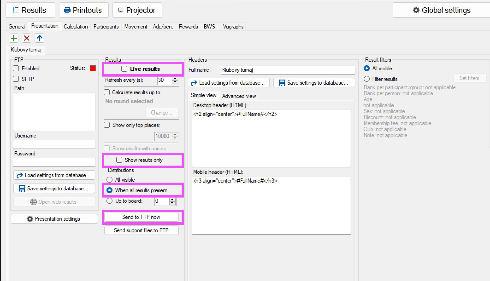

Tlačítkem `Send to FTP now` lze prezentaci nahrát ručně, nebo počkat, až se nahrává automaticky. (defaultní nastavení je každých 30s, pokud jsou zaplé Live results)

## Konec turnaje

Na konci turnaje je možné zavřít BCS.

V TC doporučuji odkliknout v záložče `Presentation` možnost Live results, aby se pod výsledky nezobrazovalo Live results, když už je turnaj dohraný.

Prezentaci pak manuálně přenahrajeme tlačítkem `Send to FTP now`, nebo počkáme, než se přenahraje automaticky.

## Odkazy

- [Střídání pro BS Havířov](/soubory/movements/bk-havirov) Přepsáno podle
  laminovaných lístků v klubu
- [Databáze hráčů z Matriky ČBS ve formátu pro TournamentCalculator]()
- [Bridge Mate Control](https://support.bridgemate.com/en/support/solutions/articles/44002262504-bridgemate-control-software-3-9-9) - program pro obsluhu bridgematů 
- [Článek s pokročilými postupy]()
- [Jak dostat databázi hráčů z Matriky do Tournament Calculator]()


