Tento článek si klade za cíl popsat a vysvětlit některé složitější postupy v
programu TC a jak je využít pro pořádání složitějších turnajů.

Jako příklad poslouží dvoukolový párový turnaj na 14 stolů s předpřipraveným
střídáním.

> Pokud nemáte zkušenosti s programe Tournament Calculator, přečtete si prosím
> nejdříve
> [článek o klubových turnajích](  ), ve
> kterém jsou popsány základní postupy. Článek stojí za přečtení, i pokud
> neplánujete používat TC na klubové turnaje, jelikož popisuje základní postupy
> a ovládání programu.

## Některé principy fungování TC

Pro porozumění fungování TC je důležité chápat některé interní principy
fungování programu. Toto porozumění nám usnadní ovládání programu, mnoho úkonů
se pak stane intutivní, také díky návodné struktuře grafického rozhraní a dobře
pojmenovaným ovládacím prvkům programu.

### Struktura turnaje

Nejprve si popíšeme strukturu turnaje v TC. Turnaj je v TC obsažen v jediném
souboru s příponou `.npc`. Tento soubor obsahuje všechny informace o turnaji,
včetně střídání, výsledků, účastníků, atd. Turnaj se dále dělí na tyto části:

- **Stage** - fáze turnaje, největší celek, např. kvalifikace, semifinále,
  finále, atd.

  V každém turnaji je defaultně jedna stage s názvem `Uncategorized sessions` a
  ID -1, do které se defaultně řadí všechna kola, sessions, při jejich
  vytváření. Pro většinu turnajů se obejdeme bez nutnosti zakládat jiné stages a
  ta defaultní postačí.

  Každá stage má svou metodu výpočtu výsledků, včetně tzv. Individual
  classification (butler v týmech) a Carry-over neboli přenosu z jiných stages.

- **Session/Kolo** - jedno kolo, každé kolo patří do stage. V dvoukolovém
  párovém turnaji budeme mít dvě kola v jedné, defaultní, stage.

Jedna session má dále tyto části:

- **Round/Sestava** - sestava. Zde je nešikovné mapování na český překlad, kolo,
  které znamená v českém názvosloví Session. Sestavy jsou části kola.
- **Stoly** - jednotlivé stoly spadají pod kolo. Stoly mohou být v místnostech
  (Open, Closed) a mohou spadat pod sectors/sekce.
- **Sets of boards/Sety krabic** - například krabice 1-2, pokud se hraje po dvou
  krabicích, bude set s číslem 1.

V textu se přikláním spíše k anglickým pojmenováním pro jednotnost s programem.

Pro přehlednost uvádím tabulku s mapováním anglických a českých termínů:

| Anglický termín | Český termín |
| --------------- | ------------ |
| Stage           | Fáze         |
| Session         | Kolo         |
| Round           | Sestava      |
| Table           | Stůl         |
| Board set       | Set krabic   |

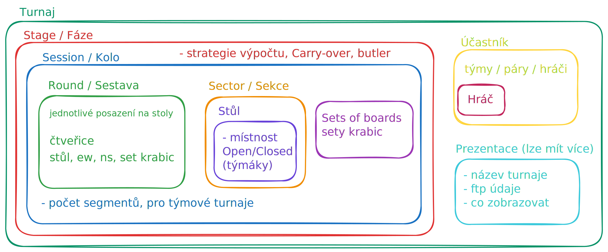

### Číslování krabic

TC využívá jiné číslování krabic, než jsou čísla na krabicích. Každá krabice má
své ID, umělé číslo. Platí, že **žádné dvě krabice ve stejném stage nemohou mít
stejné číslo** (tj. ani ve dvou různých kolech/sessions).

Pokud budeme mít dvoukolový turnaj, kde se v prvním kole budou hrát partie 1-26
a ve druhém kole 1-26, tak budeme krabice číslovat postupně 1-26 pro první kolo
a **27-52 pro druhé kolo**.

Pokud budeme střídání importovat, budeme mít v druhém kole krabice 1-26, což
musíme nahradit čísly 27-52. Toto nemusíme provádět v souboru se střídáním,
můžeme využít funkci přečíslovaní v TC, viz návod založení turnaje níže.

Čísla krabic ve hře pořád budou 1-26 v prvním i druhém kole, toto nastavíme v
záložce `Calculation` v sekci `Numbers as played`. Viz návod založení turnaje
níže.

## Založení turnaje

V následující části si vyzkoušíme založení turnaje na 14 stolů s předpřipraveným
střídáním.

1. Založíme prázdný turnaj. Dáme `File -> Empty -> Pairs`. Otevře se nám dialog
   pro uložení turnaje, vybereme název a umístění souboru.

   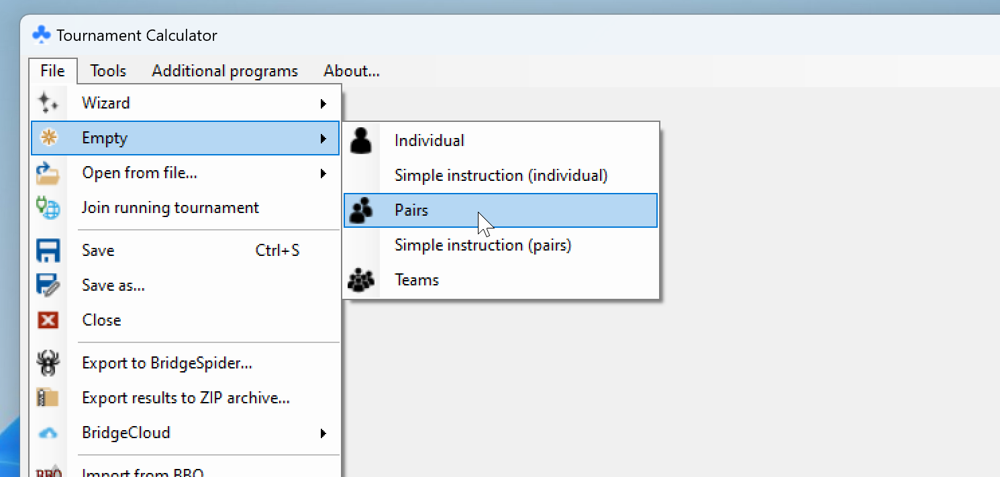

2. Vytvoříme postupně obě kola, a to postupným importem střídání.

   1. V záložce `Movement` klikneme na tlačítko `Load movement from NTP` a
      vybereme soubor se střídáním pro první kolo, v našem případě 28-1.csv.

      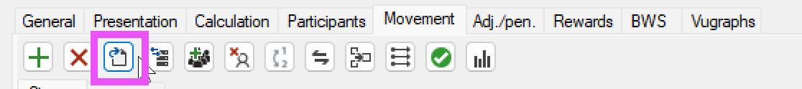

      Odklidkneme report o kvalitě střídání.

      V podzáložkách v záložce `Movement` nám přibyla Session 1.

   2. Klikneme opět na tlačítko `Load movement from NTP` a vybereme soubor se
      střídáním pro druhé kolo, v našem případě 28-2.csv.

      V podzáložkách v záložce `Movement` nám přibyla Session 2.

      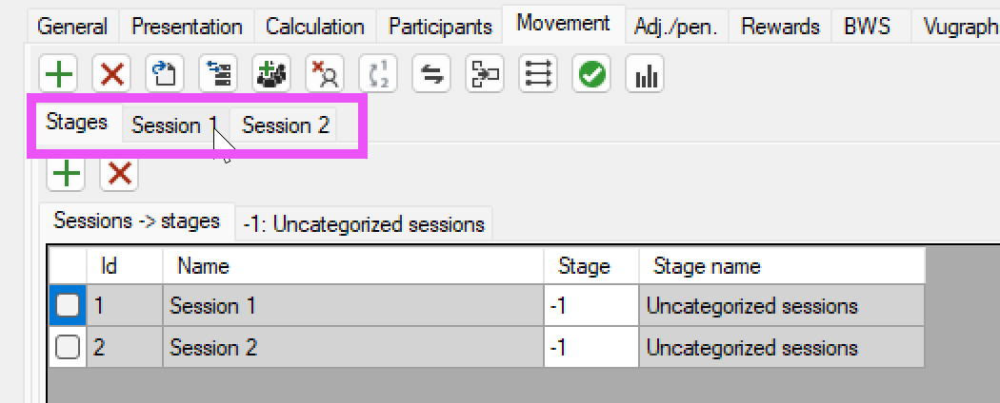

   3. (volitelné) Kolům můžeme přiřadit název (např. `1. kolo` a `2. kolo`),
      pokud chceme, a také časy začátků kol (opět pro zobrazení v prezentaci).

      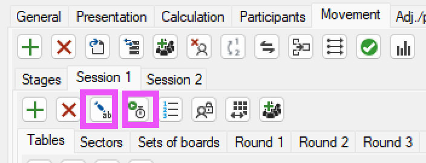

3. (volitelné) Přečíslujeme účastníky v kole.

   V našem případě máme střídání předpřipraveno již se správnými čísly,
   kdybychom ale chtěli změnit čísla účastníku např. v druhém kole, můžeme to
   udělat pomocí `Renumber participants in movement subset`.

   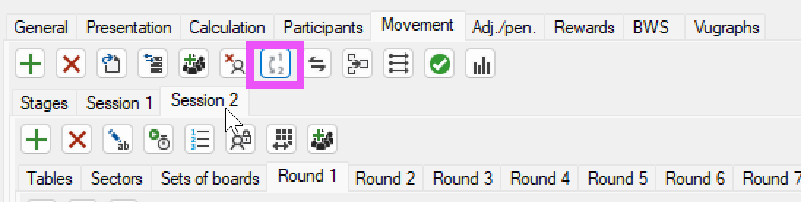

   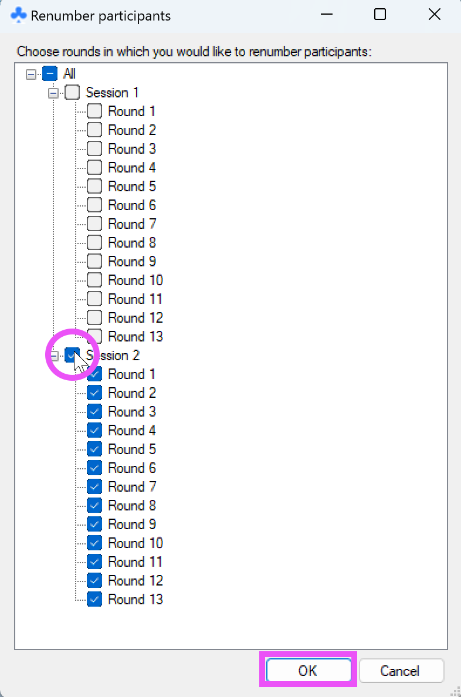

   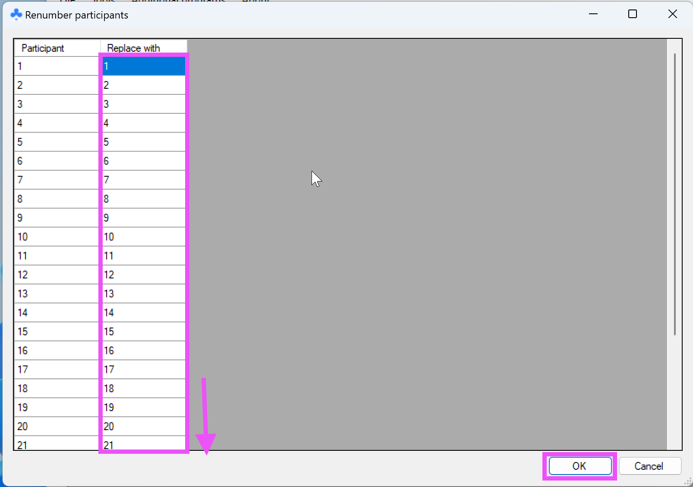

4. Přečíslujeme rozdání v druhém kole.

   Jak je popsáno výše, potřebujeme, aby každé rozdání mělo své unikátní číslo.
   Program při importu za tímto účelem přečísluje krabice, ale pokud máme

   Když v záložce `Movement` zvolíme `Session 2` a otevřeme podzáložku
   `Sets of boards`, můžeme zkotrolovat, že program opravdu přečísloval rozdání
   při importu.

   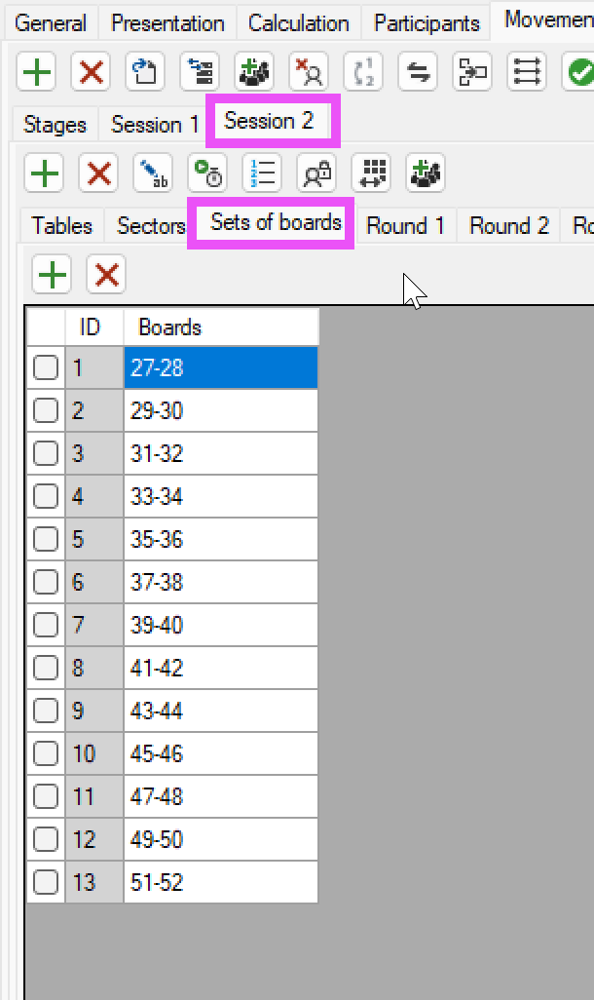

   Nyní musíme krabicím opět přiřadit čísla 1-26, aby se nám zobrazovala správná
   čísla krabic v prezentaci a v bridgematech.

   Nejdříve ale musíme synchronizovat rozpisy s výsledky.

   2. Klikneme na tlačítko `Synchronize with scores` a vybereme obě kola.

   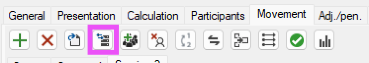

   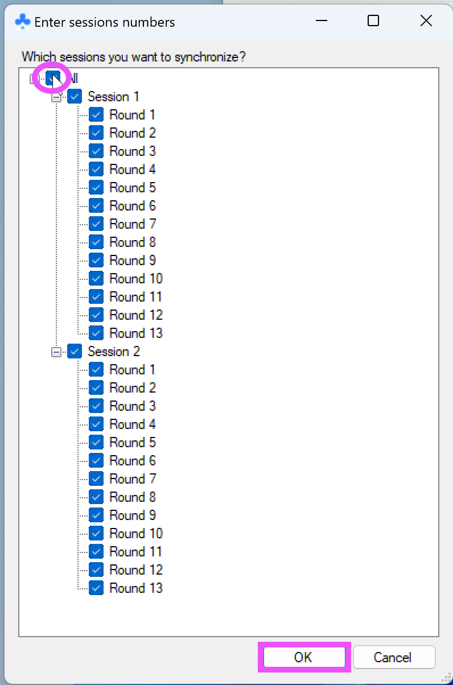

   3. V záložce `Calculation` zvolíme `Session 2` a v řádku pro krabici s ID 27
      napíšeme do druhého sloupce 1. Pokud máme zaškrtlou možnost
      `Change onward`, tak se nám automaticky přečíslují krabice od 27 do konce.

   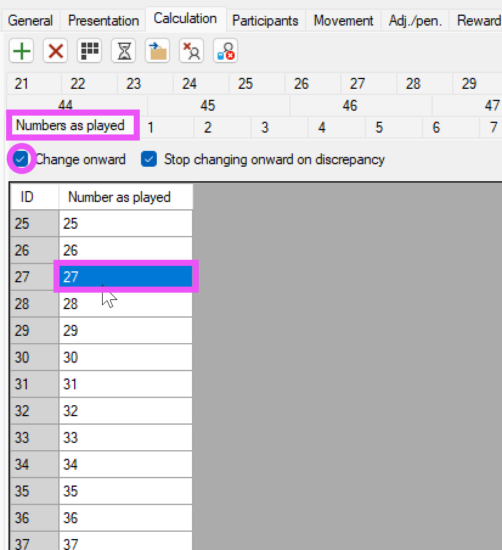 
   
   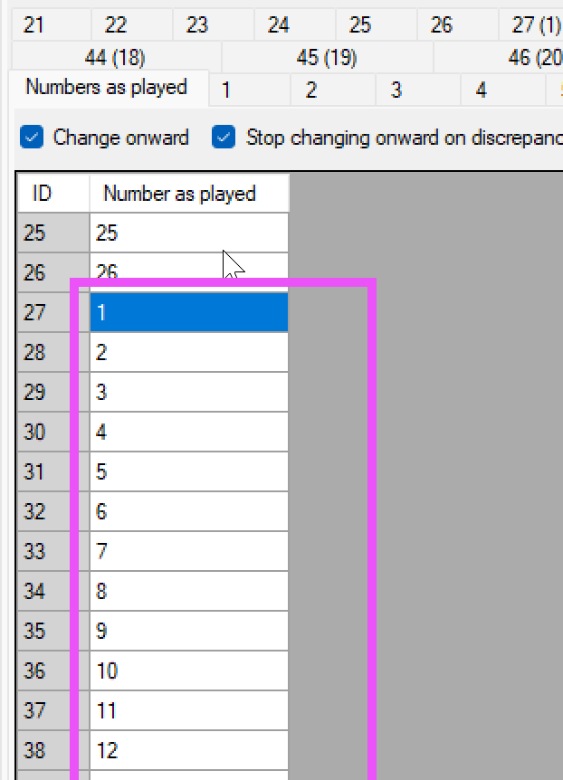

5. Nastavíme výpočetní strategii pro turnaj.

   V záložce `Movement` v podzáložce `Stages` zvolíme
   `-1: Uncategorized sessions`.

   Zde nastavíme v sekci `Calculation` výpočetní strategii. Defaultní přednastavená možnost
   `Matchpoints percentage` nám v tomto případě vyhovuje.

   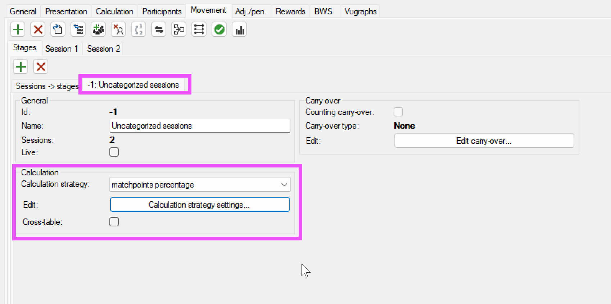

6. Nahrajeme soubory s rozdáními.

   V záložce `Calculation`. Viz návod v článku o klubových turnajích. Pro druhé
   kolo budeme muset přečíslovat rozdání.

   Za předpokladu, že pro druhé kolo máme v pbn souboru rozdání také od čísla 1,
   vyplníme dialog následovně:

   - `Load boards` - ponecháme na 1-26
   - `Move boards by` - 26
   
   
   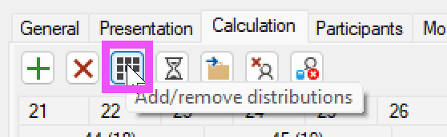 
   
   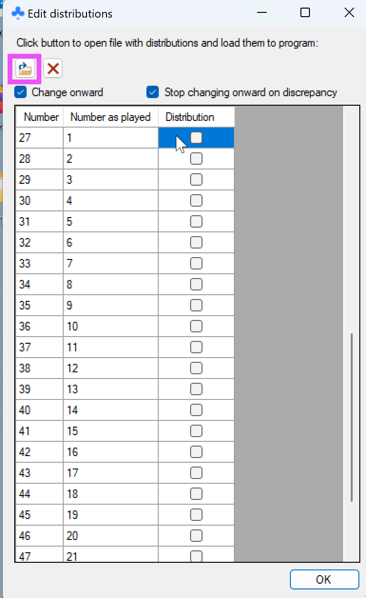 
   
   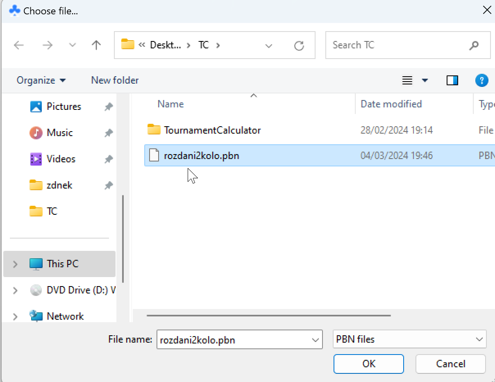
   
   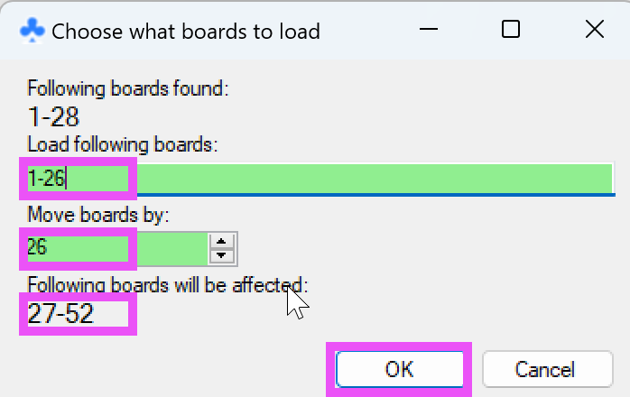 
   
   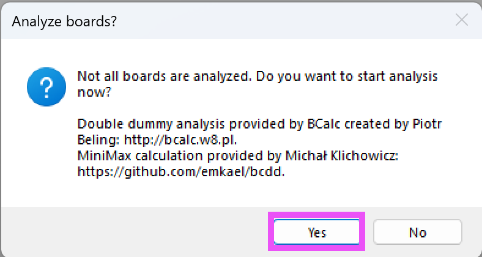 
   
   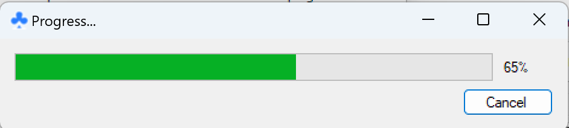 
   
   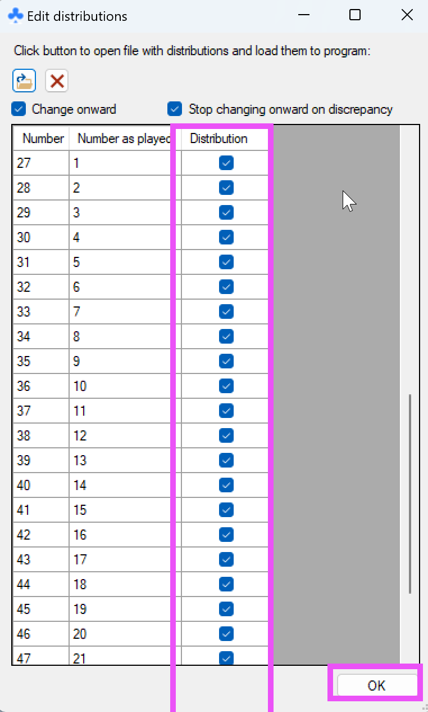

7. Připravíme prezentaci.

   Vyplníme FTP údaje a nastavíme název turnaje. Pro FTP údaje program nabízí
   uložit nastavení do interní databáze a při dalším turnaji je načíst a pouze
   změnit cestu s prezentací. Pro detailní návod viz
   [článek o klubových turnajích]( ).

8. Navedeme hráče.

   V záložce `Participants` zaklikneme `Use database` a vybereme soubor
   `databazeHracu.csv`. Nyní máme navedenou databázi a můžeme přidat hráče.

   Přidáme správný počet párů. V našem případě 28 párů.

   Pro detailní návod viz
   [článek o klubových turnajích]().

   Postup při pauze:

   Ve stejné záložce klikeneme na `Manage sit-outs` a do dialogu zadáme číslo
   pauzujícího páru, případně více, oddělené čárkou.

   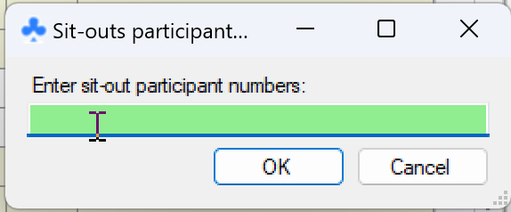
   
    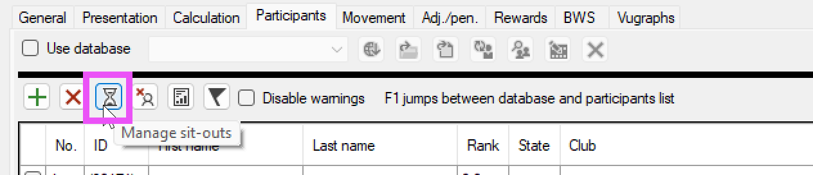

9. Vytvoříme BWS databázi a spustíme bridgematy.

   Protože máme v prvním a druhém kole stejná čísla rozdání, budeme muset pro
   každé z kol vytvořit soubor s databází zvlášť.

   Soubor databáze stačí vytvořit před začátkem kola, není nutno před prvním
   kolem tvořit soubor pro druhé kolo.

   Pro detailní návod viz
   [článek o klubových turnajích](/td-stuff/2024-02-14-klubove-turnaje-v-TC/).

## Úpravy výsledků

Veškeré úpravy výsledků provádíme v záložce `Calculation`.  
Postup je velmi intuitivní. Program poskytuje dialog i pro všechny možné formy
upravených výsledků, včetně vážených výsledků a umělých upravených výsledků.

## Na konci turnaje

Na konci turnaje není potřeba dělat nic speciálního.

Soukromé zápisaky vytiskneme v sekci `Printouts` pod `Private scores`.
Odklikneme `With distributions` - nechceme tisknout rozdání. Odklikneme
`Internal printing` - nechceme rovnou tisknout, chceme zobrazit náhled v
prohlížeči a nastavit tisknutí ručně. Takto můžeme správně nastavit stránky a
vynechat záhlaví a patičku.

Klikneme na `Selected (advanced)`, a vybere ve čtyřech krocích postupně:

- ze kterého kola chceme počítat výsledky
- ze kterého kola chceme tisknout zápisy
- podle kterého kola chceme řadit
- jestli chceme tisknout zápisáky pro všechny účastníky nebo jen pro některé

Otevře se nám náhled v prohlížeči, dáme `Ctrl+P` a se správným nastavením
tiskneme.

Poslední doporučením je v prezentaci zrušit `Live results`, aby nám z prezentace
zmizel nápis Live results, když už je turnaj dohraný.

## Závěr

V tomto článku jsme si vyzkoušeli založení složitějšího turnaje v programu
Tournament Calculator. Vyzkoušeli jsme si vytvořit turnaj na 28 stolů s
předpřipraveným střídáním a vytvořit výsledky a prezentaci.

## Odkazy

- [Článek o klubových turnajích v TC]()
- [Střídání pro dvoukolové páráky]()
