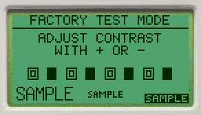

Zde je sbírka informací, které jsem nashromáždil při práci s bridgematy.

- Setup PIN je **749** (nebo 769). Nastavení setup pinu se dá změnit v setup menu.

- Pokud se dostanete do *Factory Test Mode*, 
  lze se z něj dostat stisknutím této posloupnosti kláves: 2, 5, NT, ♦️.

  

- Při donahrávání kol do BWS databáze vetšinou Bridgemates nebudou vyžadovat zadání čísel hráčů,
  a to ani když je zapnutá možnost *Player Numbers -> Enter in each round*.

  V těchto situacích je lepší mít databázi pro každé kolo zvlášť, nebo kola nahrát rovnou všechna.

## Pro vývojáře a technicky znalé

- BWS soubory jsou vlastně databáze v MS Access 1997 a 1999. Dají se otevřít v [MS Access](https://massgrave.dev/)

- Developer manual - pro práci s BWS soubory - lze [stáhnout z support.bridgemate.com](https://support.bridgemate.com/en/support/solutions/articles/44001826953-download-bridgemate-developer-s-guide)