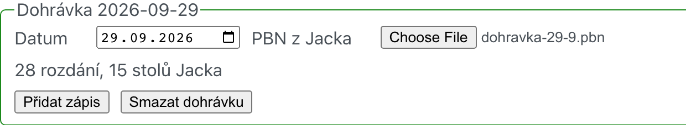
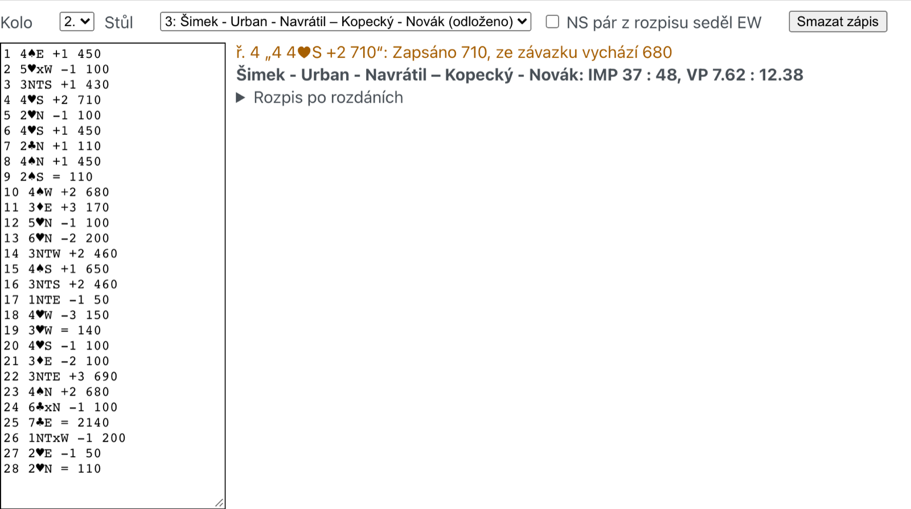
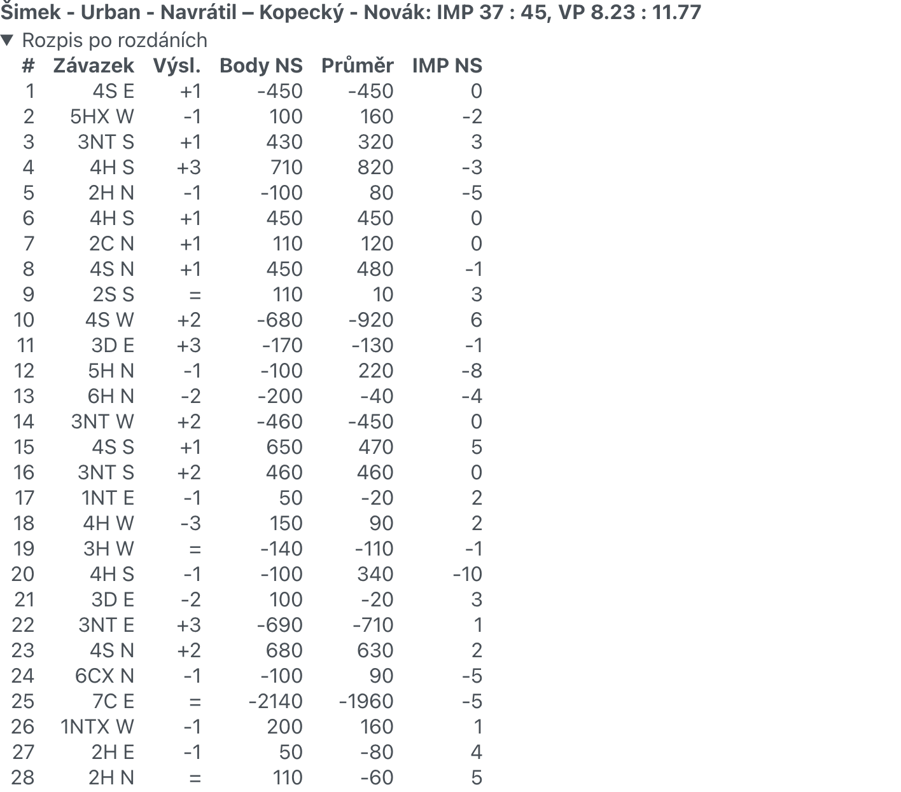
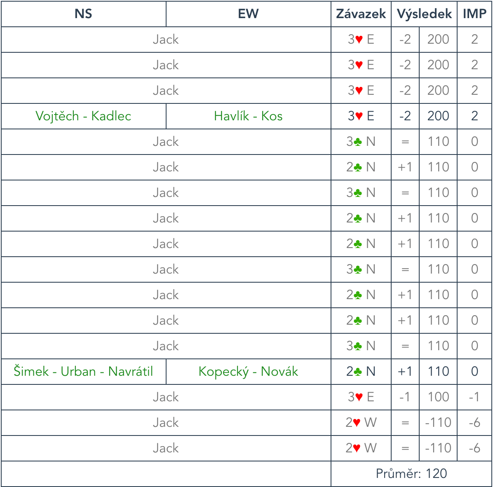

- [Jak se dohrávka počítá](#jak-se-dohrávka-počítá)
- [Co budete potřebovat](#co-budete-potřebovat)
- [Založení dohrávky](#založení-dohrávky)
- [Přepsání lístečku](#přepsání-lístečku)
- [Další stoly na stejných rozdáních](#další-stoly-na-stejných-rozdáních)
- [Uložení](#uložení)
- [Výsledky na webu](#výsledky-na-webu)

Návod, jak spočítat dohrávku skupinovky (zápas odehraný v náhradním termínu)
bez BWS, Bridgematů a Tournament Calculatoru. Srovnávací pole odehraje Jack,
výsledky z lístečku se zadají rovnou do
[prezentace výsledků](https://vysledky.bkpraha.cz) a ta dopočítá průměry,
IMPy i VP.

## Jak se dohrávka počítá

- Rozdání dohrávky odehraje Jack na 15–20 stolech. To je srovnávací pole.
- Průměr rozdání se počítá ze všech výsledků Jacka **a ze všech stolů
  dohrávky** hraných na stejných rozdáních. Z každé strany se ořízne 10 %
  výsledků (u 16 výsledků tedy 1,6 nejlepšího a 1,6 nejhoršího) a průměr se
  zaokrouhlí na desítky – stejně jako u běžných kol skupinovek.
- Každý výsledek se přepočte na IMPy proti průměru a součet IMPů za zápas na VP
  (stupnice WBF pro 28 rozdání).

## Co budete potřebovat

- PBN z Jacka se všemi odehranými stoly. Každé rozdání je v něm tolikrát, kolik
  stolů Jack odehrál (28 rozdání × 15 stolů = 420 her).
- Lístečky ze všech stolů dohrávky.
- Heslo k úpravám turnaje.

## Založení dohrávky

V [administraci](https://vysledky.bkpraha.cz/admin) otevřete turnaj a přepněte
na záložku **Dohrávky**.

[](01-zalozka.png)

Klikněte na **Nová dohrávka**, vyplňte datum a nahrajte PBN z Jacka. Pod tím se
ukáže, kolik rozdání a stolů Jacka se načetlo.

[](02-nova-dohravka.png)

Dohrávka dostane označení podle dne, kdy ji zakládáte. To se objeví v odkazu na
její stránku.

## Přepsání lístečku

Klikněte na **Přidat zápis** a vyberte kolo a stůl zápasu, který se dohrával.
Odložené stoly jsou v nabídce označené „(odloženo)“. Pokud pár, který je v
rozpisu NS, seděl při dohrávce EW, zaškrtněte **NS pár z rozpisu seděl EW**.

Do textového pole přepište lísteček, jedno rozdání na řádek:

```text
1 4SW -1 50
2 6♦W +1 940
13 3NTS = 600
14 4SxW -2 300
9 pass
```

- číslo rozdání, závazek s hlavním hráčem, výsledek (`=`, `+1`, `-2`) a skóre,
- barvy písmeny (`C D H S`, `NT` nebo `BT`) nebo symboly ♣♦♥♠, kontra `x`,
  rekontra `xx`, na mezerách nezáleží,
- skóre je nepovinné a slouží jen pro kontrolu, stačí ho opsat bez znaménka.

Vpravo se hned ukáže výsledek zápasu a upozornění. Když zapsané skóre nesedí
se závazkem, je skoro jistě špatně přečtený lísteček (třeba ♥ místo ♦).
Řádek se počítá podle závazku, takže ho opravte. Řádky, kterým program
nerozumí, jsou červeně a nepočítají se. Chybějící rozdání se vypíšou.

[](03-zapis.png)

Pod **Rozpis po rozdáních** zkontrolujete každé rozdání: body, průměr a IMPy.

[](04-rozpis.png)

## Další stoly na stejných rozdáních

Dohrávalo-li se na stejných rozdáních u více stolů, přidejte další **zápis do
téže dohrávky**, ne novou dohrávku. Průměry se počítají z Jacka i ze všech
stolů, takže se po přidání stolu změní i výsledek ostatních.

## Uložení

IMPy se samy propíšou do dohrávky v příslušném kole, v záložce kola uvidíte
výsledek i datum. Smazáním zápisu se stůl vrátí na „Odloženo“.

[](05-odklad.png)

Nakonec zadejte heslo a turnaj uložte.

## Výsledky na webu

Ve výsledcích kola vedou IMPy dohrávky na stránku dohrávky.

[](06-vysledky-kola.png)

Na stránce dohrávky jsou všechny zápasy hrané na těchto rozdáních a u každého
rozdání výsledky Jacka (šedě) i stolů dohrávky.

[](07-stranka-dohravky.png)

[](08-rozdani.png)
