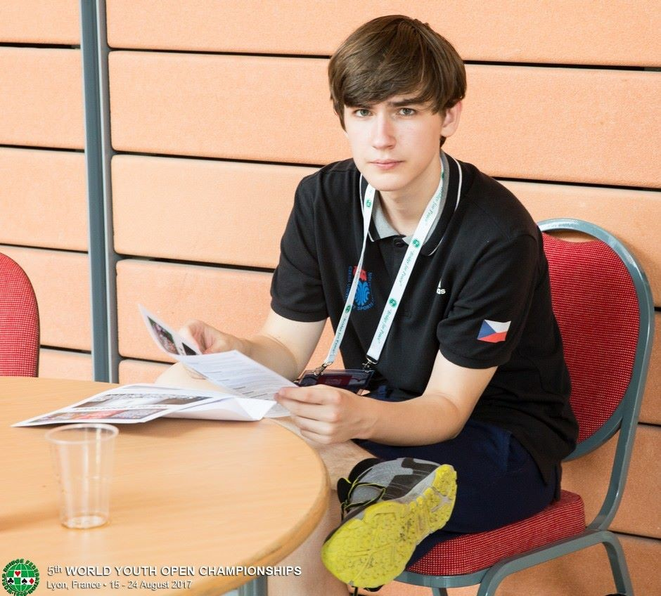
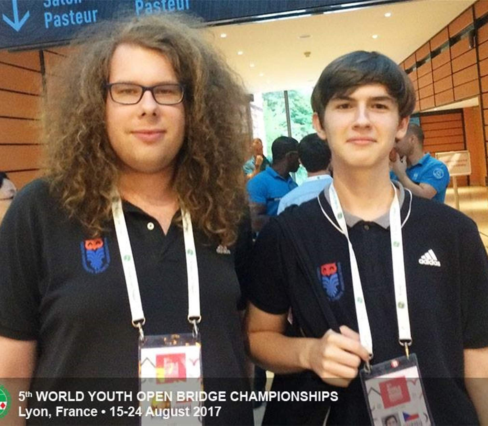
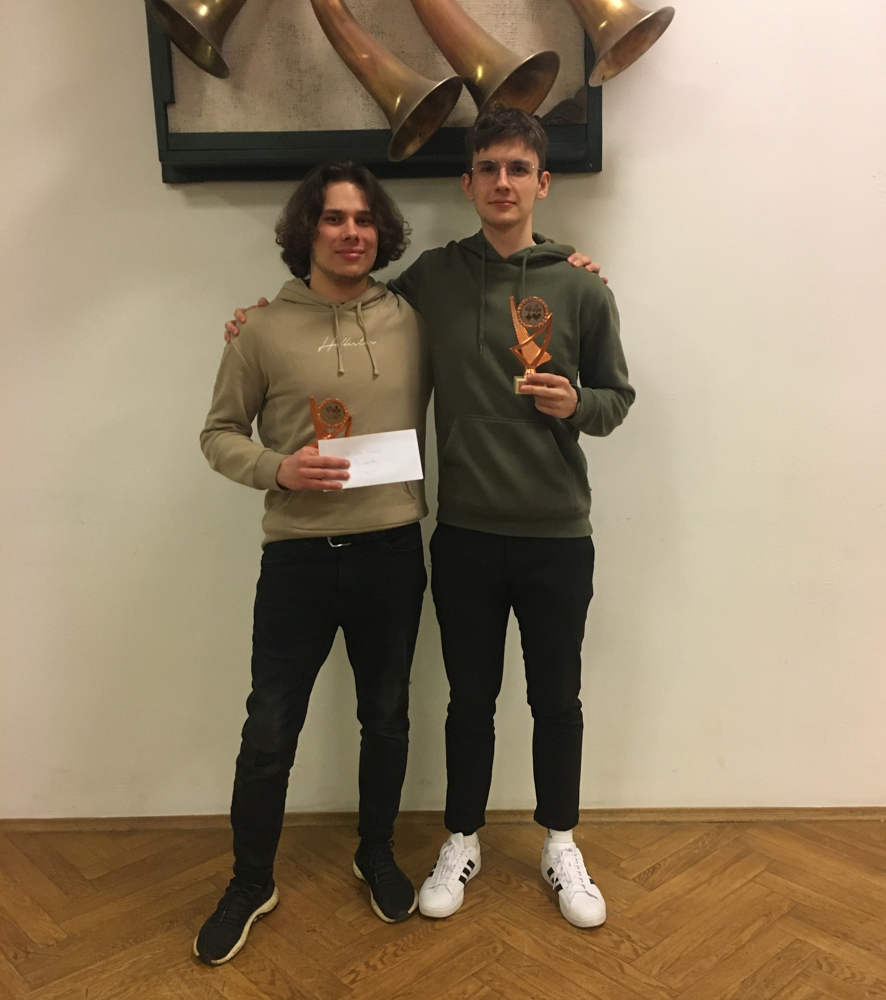
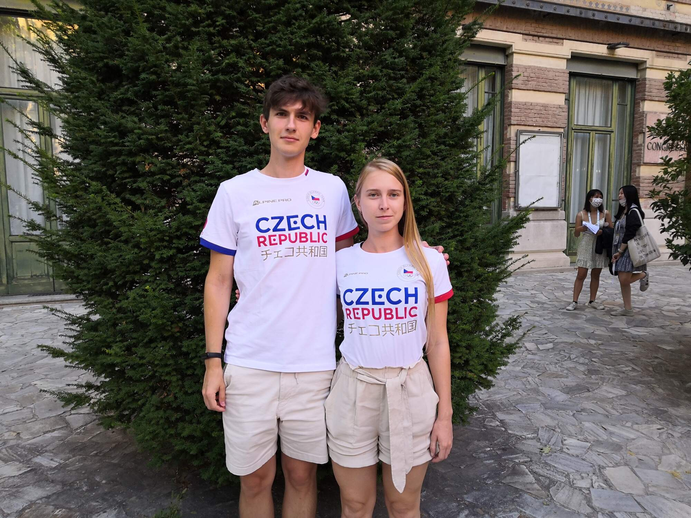
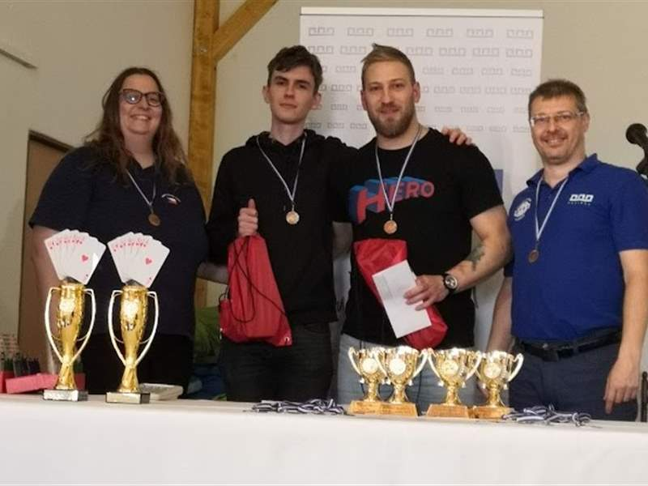
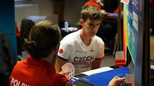
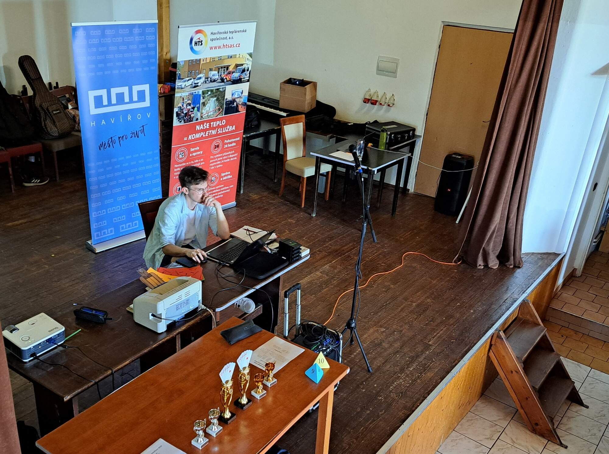

 

me in Lyon

  

Hi! My name is Zdeněk Tomis and I am a bridge person - a player, director, and
an enthusiast.

Other than that, I am a software engineer, avid reader and an entrepeuner.

I am currently based in Prague, Czechia.

## Contact

You can reach me at my email address
[zdnek.tomis@gmail.com](mailto:zdnek.tomis@gmail.com), or on the phone at
[(420) 732 767 888](tel:00420732767888).

You can also checkout [my LinkedIn profile](linkedin.com/in/zdenek-tomis) or my
personal webpage [zdenektomis.eu](https://zdenektomis.eu).

## Bridge bodies

Currently, I am a member the [Prague Bridge Club](https://bkpraha.cz), where I
direct tournaments and serve as a member of the
[club's board](https://bkpraha.cz/klub).

I am also a member of the
[Czech Bridge Federation](https://www.czechbridge.cz/), where I serve as a
member of the [Federation's board](https://www.czechbridge.cz/union).

**I welcome any questions or feedback, ideas or suggestions**.

## Zdeněk - a bridge player

I have been playing bridge since 2013. I have played in numerous tournaments,
both in Czechia and abroad.

Me with Adam Janas in Lyon, France

Me with Adam Pyszko in Budweis, Czechia

Me with Veronika Dolanská in Salsomaggiore Terme, Italy

Me with Martin Scháňka, Dan Vachtarčík, and Soňa Hájková, Havířov

Me in Antwerpen

You can find me on [Bridge Base Online](https://www.bridgebase.com) under the nick `zdenecek`, where I mostly relax playing robots or in the casual room.

To see my results record, see the WBF database [here](http://db.worldbridge.org/Repository/peopleforscrappcm/person.asp)

For results in Czechia, see the [Czech Bridge Federation Matrika database](https://matrikacbs.cz/Detail-hrace.aspx?id=2876).

## Zdeněk - a bridge director

 

me directing a tournament, Havířov

  

I have been directing bridge tournaments since 2021. 

See the [tournaments](/en/tournaments) section for a list of national tournaments in Czechia, where I took part as a TD, and
the [tournaments in the Prague bridge club](/en/bkp-tournaments) section for a list of tournaments in the Prague bridge club, which I directed or took part in.

## HABRA - where I grew up

[HABRA - the HAvířov BRidge Academy](https://bridzhavirov.cz) - is a bridge club in Havířov, Czechia, where I grew up and learned to play bridge.

I would very much like to express my deep gratitude to people who run it there, especially to my first bridge teacher, Mgr. Jarda Hájek, and my subsequent teachers, colleagues and partners, Daniel Vachtarčík, Soňa Hájková, and Petr Pszczolka.