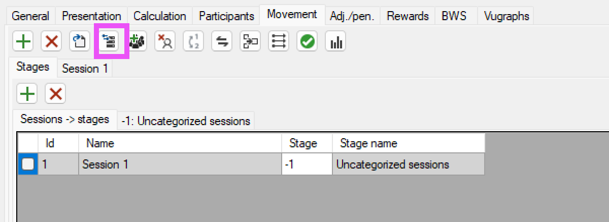

Tento článek popisuje, jak využít Tournament Calculator pro pořádání klubových
turnajů. Tedy párových turnajů s jednou sestavou.

## Vytvoření turnaje

Při vytváření turnaje máme v zásadě dvě možnosti:

1. Použíjeme průvodce (wizard), který nám dá na výběr z předdefinovaných
   střídaní, podle toho, kolik máme stolů a kolik rozdání chceme hrát. TC umí
   mnoho různých střídání. Střídací lístky pak můžeme vytisknout, případně
   můžeme střídat podle BridgeMate (Jména hráčů podporují až od verze 2).

2. Vytvoříme prázdný turnaj a střídání importujeme. Tento přístup má tu výhodu,
   že můžeme využít předpřipravené střídací lístky.

Pro import střídání je potřeba mít střídání ve formátu, který TC umí načíst. TC
umí načíst střídání v `.csv` (formát hodnoty oddělené čárkou) a sice ve velmi
jednoduchém formtu, kde každý řádek představuje jedno kolo a stůl a má tuto
podobu:

```
stůl,kolo,ns,ew,rozdání nejnižší,rozdání nejvyšší
```

Kde `ns` a `ew` jsou čísla párů.

Tento formát má jednu implikaci, a sice že pro turnaje, kde se hrají v jednom
kole rozdání z nesouvislého intervalu (např. 1-3 a 7-9), je potřeba rozdělit
kola na půlkola. Nic jako půlkola ale v TC neexistuje, každé kolo se rozdělí na
dvě celá kola a celkový počet kol bude dvojnásobný.

Pro účely toho článku vytvořím turnaj ručně a střídání importuji. Jako příklad
poslouží turnaj na čtyři stoly, použiju předpřipravený soubor se střídáním.

### Postup

1. Otevřu TC
2. Odmítnu aktualizaci, aby se mi nesmazala licence.
3. Dám `File -> Empty -> Pairs`
4. Otevře se mi dialog pro uložení turnaje, vyberu název a umístění souboru.

   Soubory turnajů v TC mají příponu `.npc` a celý turnaj je obsažen v jediném
   souboru.

#### Navigace v programu

Nyní mám otevřený prázdný turnaj. Záložky v horní části programu slouží k
navigaci. V programu jsou tyto záložky:

- **General** - obecné - zde nemusím nic měnit, obsahuje přehled o turnaji
- **Presentation** - nastavení prezentace, která je webová stránka, nahrávaná
  automaticky přes FTP. Také se zde nastavuje název turnaje.
- **Calculation** - výpočty - zde lze sledovat a upravovat výsledky a také
  nahrát rozdání ve formátu PBN, aby se poté zobrazily v prezentaci.
- **Participants** - účastníci
- **Movement** - střídací rozpisy
- Záložky Adj./pen., Rewards a Vugraph jsou pro nás nepodstatné.
- **BWS** - Správa bridgematů - zde se vytvoří soubor s databází pro bridgemate
  a lze odsud také rovnou spustit program pro obsluhu bridgematů.

### Další postup

V dalších krocích postupně provedu tyto úkony:

1.  Navedení hráčů
2.  Import střídání
3.  Vytvoření BWS databáze a spuštění bridgematů
4.  Nastavení prezentace s výsledky

#### Navedení hráčů

Pro tento účel navedeme do programu databázi českých hráčů z ČBS.

Databázi hráčů lze stáhnout z [Matriky ČBS](https://matrikacbs.cz/). Formát souboru ale není ve správném formátu. Upravený soubor lze stáhnout [zde (`databazeHracu.csv`)](/soubory/databazeHracu.csv).


1. stáhnu `databazeHracu.csv`
2. v záložce `Participants` zakliknu `Use database`
3. vyberu možnost Custom pro formát databáze
4. vyberu tlačítka Open from file a vyberu soubor `databazeHracu.csv`

Nyní máme navedenou databázi a můžeme přidat hráče.

Přidám správný počet párů. V našem připadě 8 párů. 


1. Kliknu na tlačítko `+`
2. Zadám 1-8 pro čísla párů od 1 do 8, potvrdím.

Nyní postupně zadám všechny hráče, zadáním např. přijmení lze vyhledat hráče v databázi, poté dvojitým poklepáním na jméno hráče ho přidám do turnaje, případně lze taky přeskakovat mezi panelem s databází a s hráči pomocí F1 a nalazeného hráče potvrdit pomocí Enter.


Zde je prostor pro zjednodušení. Do tabulky lze kopírovat více buněk najednou, také lze využít možnosti vyplnit pouze jména a zbytek zkusit doplnit podle databáze, viz níže:


Vyplním pouze jména, lze zkopírovat z přihlášek a kliknu na tlačítko dohledat hráče.


Vyberu vyhledávání podle jmen.


Hráčům byla doplněna čísla ČBS.

Tuto operaci je možno zcela přeskočit, pokud necháme zadat hráče jejich čísla do Bridgematů. Potom lze hráče přečíst a přiřadit podle databáze tlačítkem v záložce BWS.


#### Import střídání

Nyní máme navedené hráče a můžeme importovat střídání.

1. V z8ložce `Movement` kliknu na horní tlačítko `load movement from NTPN/CSV/TXT` pro vytvoření nové sestavy s požadovaným střídáním.


2. Vyberu soubor, v našem případě `4zluta.csv` a potvrdím.
3. Program zobrazí report s kvalitou střídání, odklepnu OK.
4. Kliknu na tlačítko `Synchronize with scores` pro sjednocení rozpisu s výpočty



Vyberu sjednocení všech kol.


Odkliknu OK v potvrzovacím dialogu.

#### Spuštění Bridgematů a vytvoření souboru s databází

1. V záložce BWS kliknu na tlačítko `Create new BWS`  
   BWS je formát databáze výsledků pro bridgematy. Nikdy ho nebudeme otevírat, ale pro zajímavost se jedná o databázi MS Access se změněnou příponou.


2. V dialogu vyberu soubor, kam se má BWS uložit a potvrdím.
3. Opět zvolím všechna kola kliknutím na políčko `All` a potvrdím.
4. Otevře se mi nastavení Bridgematů, tato nastavení odpovídají nastavením, která se dají změnit v programu BCS pro obsluhu bridgematů.


Z nastavení zmíním nejdůležitější:

- Show previous results - ukazovat výsledky z ostatních stolů. Osobně to nemám rád, zdržuje to, na klubovém turnaji to může být příjemné pro hráče, většina to má ráda.
- Lead card - zadávání výnosů - na klubovém turnaji je to asi zbytečné.
- Member numbers - čísla hráčů - pokud jsou čísla hráčů vložena do bridgematů, lze je přečíst a přiřadit podle databáze tlačítkem v záložce BWS. 
  - Number entry at each round - zadávání čísel hráčů při každém kole - není potřeba.
- Run BCS - rovnou spustí program pro obsluhu bridgematů s vytvořenou databází.
- Save as Default - uloží nastavení jako výchozí, příště se tato nastavení načtou.

Doporučuji vše nastavit podle obrázku výše.

Poté stačí potvrdit OK a program vytvoří soubor s databází a spustí program pro obsluhu bridgematů. (pokud jsme zvolili Run BCS)

Pokud se BridgeMateControl nespustí, je možné, že není nastavena cesta k programu. Tuto cestu lze nastavit v záložce `BWS` v sekci Nastavení, viz níže.


Poté je vždy možné spustit BridgeMateControl z TC, a to pomocí zeleného tlačítka Run BCS.


#### Nastavení prezentace

Pro prezentaci musím vyplnit správně

- FTP údaje
  - cestu ve formátu ftp://adresa-serveru/relativni/cesta/adresare/pro/prezentaci
  - uživatelské jméno/login
  - heslo
- Název turnaje

Cestu doporučuji volit systematicky, například pro každý rok jeden adresář, nebo adresář s názvem začínajícím datem, např. `2024-02-12-klubovy-turnaj`, nebo `2024/02-12-klubovy-turnaj`.


Další možnosti, které lze nastavit:

- Live results - zobrazovat výsledky živě
- Show results only - nezobrazovat rozdání
- Distributions - Možnost `When all results present` zobrazí v prezentaci rozdání, u kterých jsou výsledky ze všech stolů.


Tlačítkem `Send to FTP now` lze prezentaci nahrát ručně, nebo počkat, až se nahrává automaticky. (defaultní nastavení je každých 30s, pokud jsou zaplé Live results)

### Konec turnaje

Na konci turnaje je možné zavřít BCS.

V TC doporučuji odkliknout v záložče `Presentation` možnost Live results, aby se pod výsledky nezobrazovalo `Live results`, když už je turnaj dohraný.

Prezentaci pak manuálně přenahraji tlačítkem `Send to FTP now`, nebo počkám, než se přenahraje automaticky.


## Soubory ke stažení

- [Střídání pro BS Havířov](/soubory/movements/bk-havirov) Přepsáno podle
  laminovaných lístků v klubu
- [Databáze hráčů ČBS](/soubory/databazeHracu.csv) uzpůsobená pro import do TC
- [Bridge Mate Control](https://support.bridgemate.com/en/support/solutions/articles/44002262504-bridgemate-control-software-3-9-9) - program pro obsluhu bridgematů 
